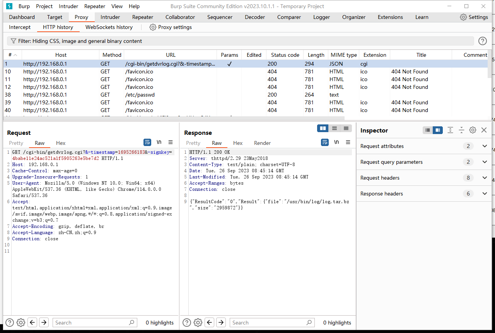
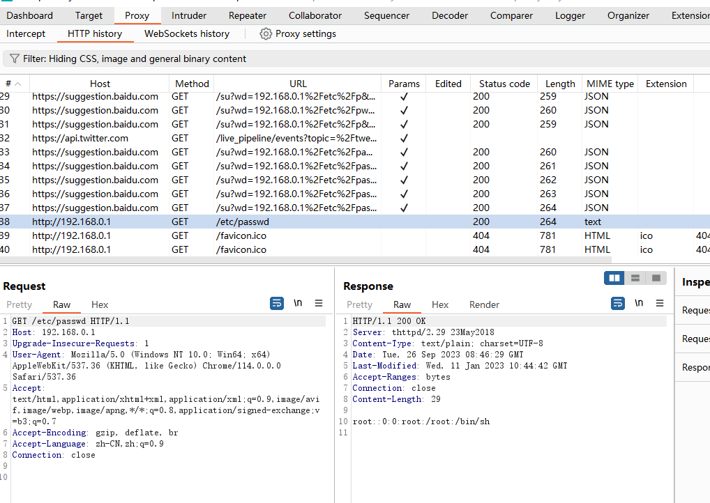

**Vulnerability description**

70mai a500s、70mai a810s、70mai x200  Dash Cam , Firmware: 1.2.119、v、v1.4.69,  suffers from an unauthenticated arbitrary file disclosure vulnerability. Input passed through the 'file' GET parameter through the 'cgi-bin/getdvrlog.cgi' url is not properly verified before being used to download log files. This can be exploited to disclose the contents of arbitrary and sensitive files via directory traversal attacks.

